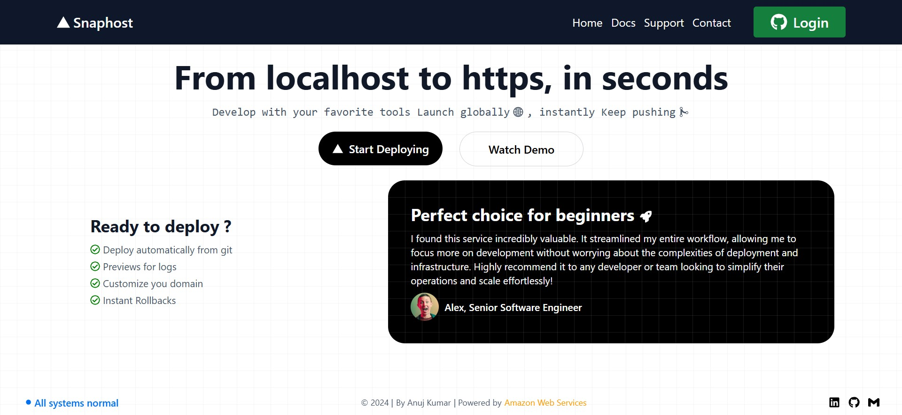
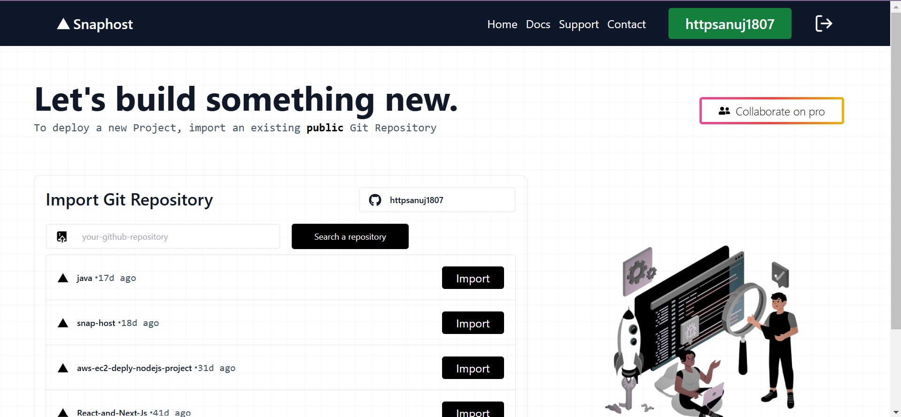
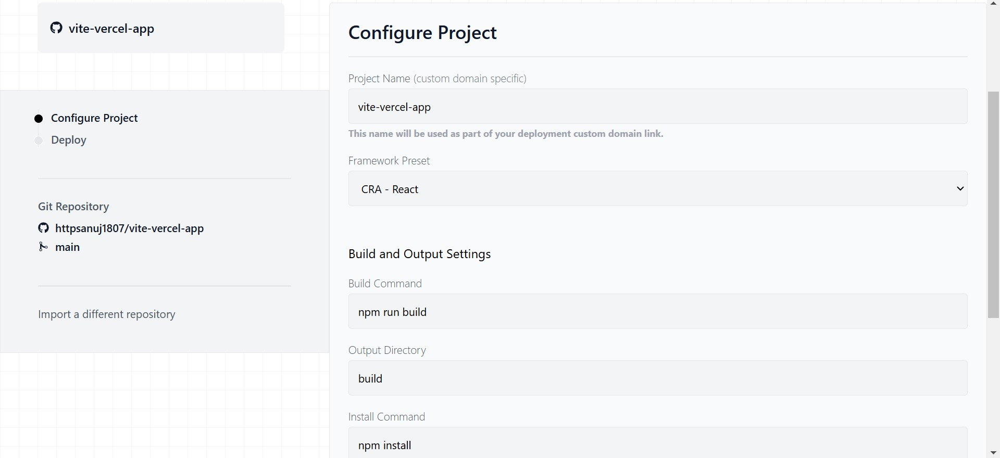
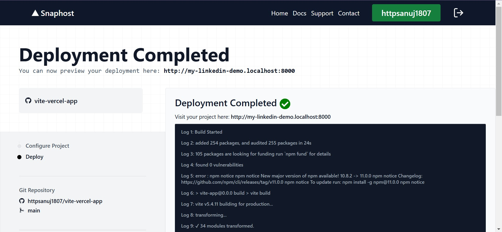
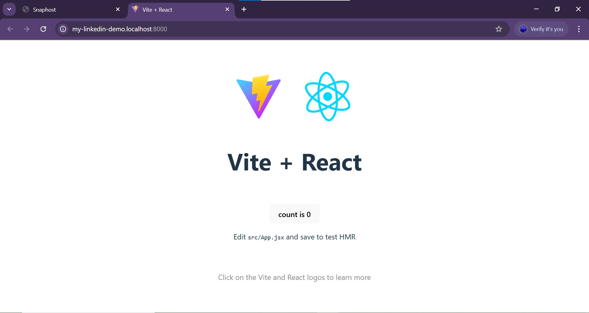

# Snaphost

**Snaphost** is a platform that streamlines front-end deployment for web applications. Built using AWS cloud services, Snaphost allows users to deploy their frontend with ease by linking their GitHub accounts. The platform automates deployment by fetching repositories, triggering builds, and providing live previews with a simple one-click deployment process. The entire backend infrastructure is powered by AWS services such as ECS, ECR, and S3, ensuring a seamless and efficient deployment process.

---

## Table of Contents

1. [Introduction](#introduction)
2. [Features](#features)
3. [How It Works](#how-it-works)
4. [Local Setup](#local-setup)
5. [Technical Details](#technical-details)
6. [Screenshots](#screenshots)
7. [Contributing](#contributing)
8. [License](#license)
9. [Contact](#contact)

---

## Introduction

Snaphost is a platform that simplifies front-end deployment by integrating with GitHub. It offers seamless GitHub authentication, auto-fetches repositories, and provides users with an easy-to-use UI for deployment. Once users link their GitHub accounts, they can quickly deploy their applications with custom domain names, environment variables, and build settings. Snaphost handles the build, deploy, and logs preview process, enabling automated deployment functionality.

---

## Features

- **GitHub Authentication**: Log in to Snaphost using your GitHub account.
- **Repository Integration**: Auto-fetch your GitHub repositories or search for repositories by name to import them.
- **Custom Configuration**: Set custom domain names, install commands, build commands, and environment variables before deploying.
- **AWS-backed Infrastructure**: Uses AWS ECS to run Docker containers, AWS ECR for container image storage, and AWS S3 for storing the final build.
- **Live Build Logs**: Provides real-time logs of the build process, streamed to the frontend via AWS Elasticache and WebSocket.
- **Automated Deployment**: One-click deployment to trigger the build and deployment pipeline.
- **Live Preview URL**: After successful deployment, users receive a live URL to view their deployed project.

---

## How It Works

1. **GitHub Authentication**: 
   - Users authenticate through GitHub (backed by Firebase Authentication) to allow Snaphost to access their repositories.
   
2. **Repository Selection**: 
   - After authentication, users can see a list of their repositories and select one to deploy. Alternatively, users can search by repository name to import their project.

3. **Configuration**: 
   - Users provide necessary configurations such as custom domain name, install command, build command, and environment variables (if any) via the UI.

4. **Deployment Process**: 
   - Once the configuration is set, users click the "Deploy" button. 
   - Snaphost then triggers a container within AWS ECS, using a pre-defined task. 
   - The container clones the selected repository, builds the project, and uploads the final build to AWS S3.

5. **Live Build Logs**: 
   - During the build process, the logs are captured and streamed to the frontend via AWS Elasticache and WebSocket for real-time updates.

6. **Deployment URL**: 
   - After a successful build and deployment, Snaphost provides a live URL for the user to preview their deployed project.

---

## Local Setup

Follow the steps below to set up Snaphost locally:

### Prerequisites

- **Node.js**: Install [Node.js](https://nodejs.org/) (LTS version recommended).
- **Docker**: Install [Docker](https://www.docker.com/) for containerized builds.
- **Git**: Ensure Git is installed to clone the repository.

### Steps

1. **Clone the Repository**  
   ```bash
   git clone https://github.com/httpsanuj1807/snap-host.git
   cd snap-host
   ```

2. **Install Dependencies**  
   Navigate to the project folders (`frontend`, `api-server`, and `build-server`) and install dependencies:
   ```bash
   cd frontend
   npm install
   cd ../api-server
   npm install
   cd ../build-server
   npm install
   ```

3. **Set Up Environment Variables**  

   - **Frontend**:  
     Create a `.env` file in the `frontend` folder and add the following:
     ```env
     VITE_GIT_TOKEN=""
     VITE_FIREBASE_API_KEY=""
     VITE_FIREBASE_APP_ID=""
     VITE_BACKEND_URL="http://localhost:"
     VITE_BACKEND_PORT="9000"
     VITE_SOCKET_PORT="9002"
     ```

   - **API Server**:  
     Create a `.env` file in the `api-server` folder and add the following:
     ```env
     ACCESS_KEY_ID=""
     SECRET_ACCESS_KEY=""
     REDIS_URL=""
     MONGODB_URL=""
     JWT_SECRET=""
     BACKEND_HOST="localhost:5173"
     PROXY_SERVER="localhost:8000"
     ```

   - **Build Server**:  
     Create a `.env` file in the `build-server` folder and add the following:
     ```env
     ACCESS_KEY_ID=""
     SECRET_ACCESS_KEY=""
     REDIS_URL=""
     ```

4. **Start Services**  

   - **Frontend**:
     ```bash
     cd frontend
     npm run dev
     ```

   - **API Server**:
     ```bash
     cd api-server
     npm run start
     ```

   - **Build Server**:
     ```bash
     cd build-server
     npm run start
     ```

5. **Access the Application**  
   Open your browser and navigate to `http://localhost:5173` to view the Snaphost frontend.

---

## Technical Details

- **GitHub API**: Used for authentication and fetching user repositories.
- **AWS ECS**: Container orchestration service that runs the deployment tasks.
- **Docker**: Used to build the image and deploy user repositories in isolated environments.
- **AWS ECR**: Container registry used to store Docker images.
- **AWS S3**: Used for storing the final build of the user’s application.
- **AWS Elasticache + WebSockets**: Used for real-time log streaming from the container to the frontend.

---

## Screenshots

Below are some screenshots of the Snaphost platform in action:


*Figure 1: Snaphost homepage.*


*Figure 2: Snaphost Dashboard showing the list of repositories of logged user.*


*Figure 3: Repository configuration screen where users set build commands and domain.*


*Figure 4: Real-time build logs during the deployment process.*


*Figure 5: Live preview provided to the user after deployment.*

---

## Contributing

We welcome contributions from the community. If you have suggestions, bug fixes, or new features, feel free to fork the repository and create a pull request.

### How to Contribute:

1. Fork the repository.
2. Create a feature branch (`git checkout -b feature-name`).
3. Implement your changes.
4. Commit your changes (`git commit -m 'Add feature-name'`).
5. Push to your branch (`git push origin feature-name`).
6. Open a pull request with a description of the changes.

---

## 🌎 Contact

[](https://github.com/httpsanuj1807)
[](https://www.linkedin.com/in/anuj-kumar-7837a9268)
[](https://www.instagram.com/https_anuj1807)

Thank you for using Snaphost! We hope it makes your front-end deployment experience seamless and efficient. If you encounter any issues, please don't hesitate to reach out.
